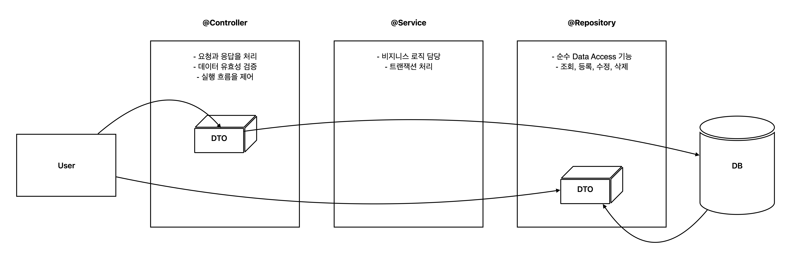

## MyBatis

- SQL Mapping Framework - Easy & Simple
- 자바 코드로부터 SQL문을 분리해서 관리
- 매개변수 설정과 쿼리 결과를 읽어오는 코드를 제거
- 작성할 코드가 줄어서 생산성 향상 & 유지 보수 편리

---

- SqlSessionFactory - SqlSession을 생성해서 제공
- SqlSession + SQL명령을 수행하는데 필요한 메서드 제공

- SqlSessionFactoryBean - SqlSessionFactory를 Spring에서 사용하기 위한 빈
- SqlSessionTemplate - SQL명령을 수행하는데 필요한 메서드 제공. thread-safe

```java
<bean id="sqlSessionFactory" class="org.mybatis.spring.SqlSessionFactoryBean">
		<property name="dataSource" ref="dataSource"/>
        <property name="mapperLocations" value="classpath:mapper/*Mapper.xml"/>
	</bean>

	<bean id="sqlSession" class="org.mybatis.spring.SqlSessionTemplate">
		<constructor-arg ref="sqlSessionFactory"/>
	</bean>
```

---

|메서드|설명|
|:---|:---|
|int insert(String statement) <br>int insert(String statement, Object parameter)|insert문을 실행하고, insert된 행의 갯수를 반환|
|int delete(String statement) <br>int delete(String statement, Object parameter)|delete 실행하고, delete된 행의 갯수를 반환|
|int update(String statement) <br>int update(String statement, Object parameter)|update 실행하고, update된 행의 갯수를 반환|
|T selectOne(String statement) <br>T selectOne(String statement, Object parameter)|하나의 행을 반환하는 select에 사용 <br>paramter로 SQL에 binding될 값 제공
|List<E> selectList(String statement) <br>List<E> selectList(String statement, Object parameter)|여러 행을 반환하는 select에 사용 <br>paramter로 SQL에 binding될 값 제공|
|Map<K,V> selectMap(String statement, String keyCol) <br>Map<K,V> selectMap(String statement, String keyCol, Object parameter)|여러 행을 반환하는 select에 사용 <br>keyCol에 Map의 Key로 사용할 컬럼 지정|

---

### BoardDao

1. DB테이블 작성

```sql
create table board (
	bno int auto_increment primary key,
	title varchar (45) not null,
	content text not null,
	writer varchar (30) not null,
	view_cnt int default 0 null,
	comment_cnt int default 0 null,
	reg_date datetime null
);
```

2. Mapper XML & DTO 작성

```java
<mapper namespace="com.fastcampus.ch4.dao.BoardMapper">
	<select id="select" parameterType="int" resultType= "BoardDto">
		SELECT bno, title, content, writer
			, view_cnt, comment_cnt, reg_date
			FROM board
			WHERE bno = #{bno}
	</select>
```

3. DAO인터페이스 작성

```java
public interface BoardDao {
	BoardDto select(Integer bno) throws Exception;
	int delete(Integer bno) throws Exception;
	int insert(BoardDto dto) throws Exception;
	int update(BoardDto dto) throws Exception;
	int increaseViewCnt(Integer bno) throws Exception;
}
```

4. DAO인터페이스 구현 & 테스트

```java
@Repository
public class BoardDaoImpl implements BoardDao {
	@Autowired
	SqlSession session;

	String namespace = "com.fastcampus.ch4.dao.BoardMapper.";

	@Override
	public BoardDto select(Integer bno) throws Exception {
		return session.selectOne(namespace + "select", bno);
} // T selectOne(String statement, Object parameter)
```

---

### DTO - Data Transfer Object

- 계층간의 데이터를 주고 받기 위해 사용되는 객체

```java
public class BoardDto {
	private Integer bno;
	private String title;
	private String content;
	private String writer;
	private int view_cnt;
	private int comment_cnt;
	private Date reg_date;

	// 생성자, getter & setter, toString()
	// ...
}
```



---