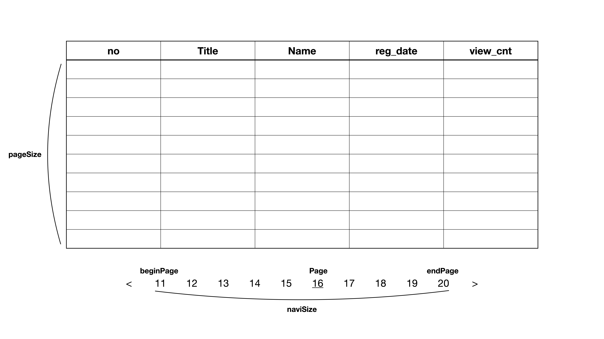

## Pagination



```java
public class PageHandler {
    private int page; // 현재 페이지
    private int pageSize; // 한 페이지의 크기
    private int totalCnt; // 총 게시물 갯수
    private int naviSize = 10; // 페이지 내비게이션의 크기
    private int totalPage; // 전체 페이지의 갯수
    private int beginPage; // 내비게이션의 첫번째 페이지
    private int endPage; // 내비게이션의 마지막 페이지
    private boolean showPrev; // 이전 페이지로 이동하는 링크를 보여줄 것인지의 여부
    private boolean showNext; // 다음 페이지로 이동하는 링크를 보여줄 것인지의 여부
}

public PageHandler(int totalCnt, int page) {
    this(totalCnt, page , 10);
}

public PageHandler(int totalCnt, int page, int pageSize) {
    ...

    totalPage = (int) Math.ceil(totalCnt / (double) pageSize);
    beginPage = (page - 1) / naviSize * naviSize + 1;
    endPage = Math.min(beginPage + naviSize - 1, totalPage);
    showPrev = beginPage != 1;
    showNext = endPage != totalPage;
}
```

---

### LIMIT offset, row_count

```java
Map map = new HashMap();
map.put("offset", (page - 1) * pageSize);
map.put("pageSize". pageSize);
```

```xml
<select id="searchSelectPage" parameterType="map" resultType="BoardDto">
    SELECT * 
    FROM board 
    OREDER BY reg_date DESC, bno DESC
    LIMIT #{offset}, #{pageSize}
</select>
```

---