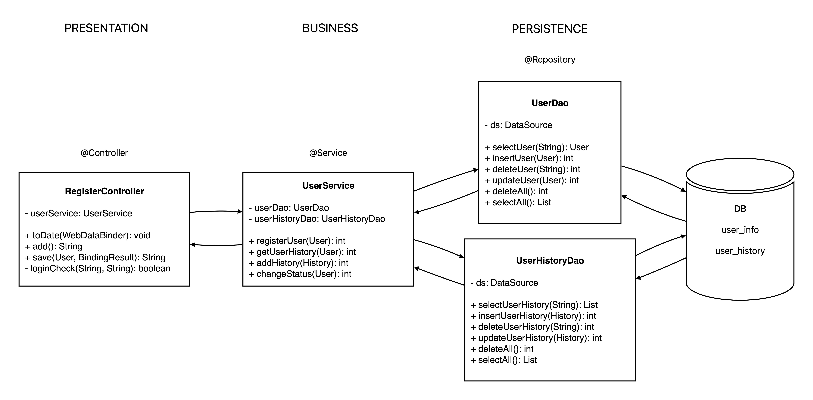

## Service Layer



---

## TransactionManager

- DAO의 각 메서드는 개별 Connection을 사용
- 같은 Tx내에서 같은 Connection을 사용할 수 있게 관리
- DAO에서 Connection을 얻거나 반환할 때 DataSourceUtils를 사용해야

```java
conn = ds.getConnction();
// ...
try {
    if (conn != null)
    conn.close();
} catch (SQLException e) {
    e.printStackTrace();
}

    ->

conn = DataSourceUtils.getConnection(ds);
// ...
DataSourceUtils.releaseConnection(conn, ds);
```

### TransactionManager로 Transaction 적용하기

```java
<bean id="transactionManager" class="org.springframework.jdbc.datasource.DataSourceTransactionManager">
    <property name="dataSource" ref="dataSource"/>
</bean>
<tx:annotation-driven/>
```

---

## @Transactional

- AOP를 이용한 핵심 기능과 부가 기능의 분리
- @Transactional은 클래스나 인터페이스에도 붙일 수 있음

### @Transactional의 속성

|속성|설명|
|:---:|:---|
|propagation|Tx의 경계(boundary)를 설정하는 방법을 지정|
|isolation|Tx의 isolation level을 지정. DEFAULT, READ_UNCOMMITTED, <br>READ_COMMITTED, REPEATABLE_READ, SERIALIZABLE|
|readOnly|Tx이 데이터를 읽기만 하는 경우, true로 지정하면 성능이 향상|
|rollbackFor|지정된 예외가 발생하면, Tx을 rollback <br>RuntimeException과 Error는 자동 rollback|
|noRollbackFor|지정된 예외가 발생해도, Tx을 rollback하지 않음|
|timeout|지정된 시간(초) 내에 Tx이 종료되지 않으면, Tx를 강제 종료

### propagation속성의 값

|값|설명|
|:---:|:---|
|**REQUIRED**|Tx이 진행중이면 참여하고, 없으면 새로운 Tx 시작(디폴트)|
|**REQUIRES_NEW**|Tx이 진행 중이건 아니건, 새로 TX 시작|
|NESTED|Tx이 진행 중이면, Tx의 내부 Tx로 실행|
|MANDATORY|반드시 진행 중인 Tx내에서만 실행가능. 아니면 예외 발생|
|SUPPORTS|Tx이 진행 중이건 아니건 상관없이 실행|
|NOT_SUPPORTED|Tx없이 처리. Tx이 진행 중이면 잠시 중단(suspend)|
|NEVER|Tx없이 처리. Tx이 진행 중이면 예외 발생|

---